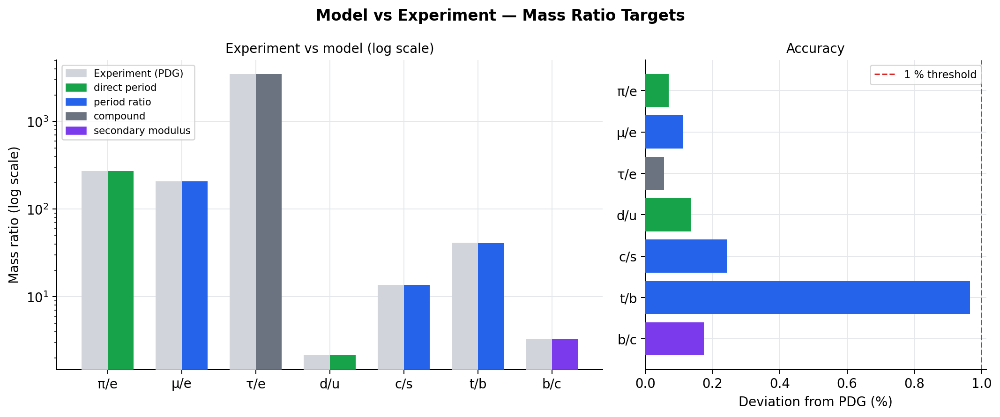
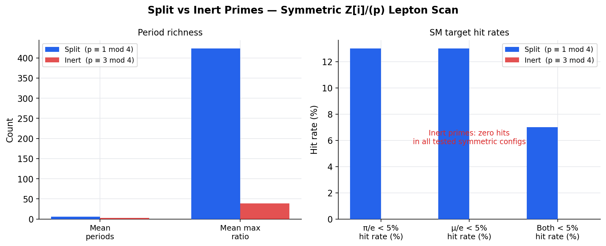
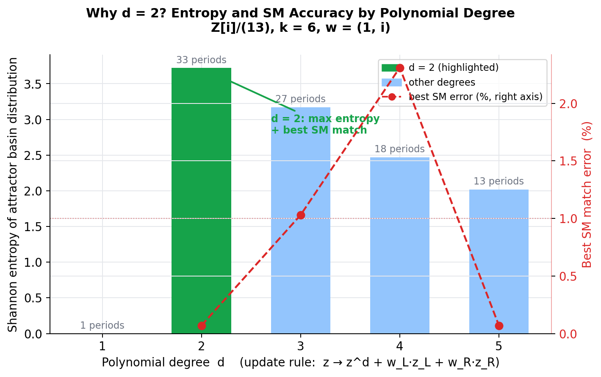
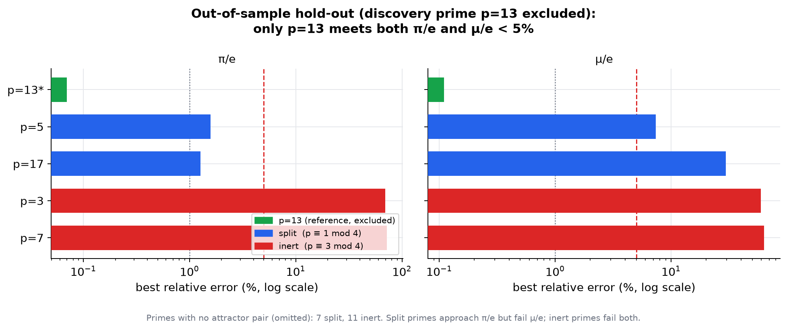

# Finite Precision Loop Mechanics

[](https://github.com/reinehr/finite-precision-loop-mechanics/actions/workflows/ci.yml)
[](https://creativecommons.org/licenses/by-nc/4.0/)
[](https://www.python.org/downloads/)

This repository presents a mechanism-first idea:

> If physical processes have finite precision, then rounding is not merely an error. It can become a physical mechanism: it creates thresholds, residues, attractor basins, loop traps, inertia-like resistance, radiation-like leakage, interaction modes, and eventually an emergent relational space.

The numerical mass-ratio results are important, but they are not the starting point. They are evidence that this finite-precision mechanics may generate nontrivial particle-like structure in a concrete model.

---

## Core Intuition

The project begins with a conservative physical suspicion:

```text
No actual physical system can carry infinite precision.
```

If this is true, then physical evolution cannot be a perfectly continuous computation over infinitely resolved real numbers. It must contain some form of finite state, finite distinguishability, or effective rounding.

In a finite deterministic state space, processes eventually repeat. Most repetitions are uninteresting. Some, however, can become stable attractor cycles. This repository calls those cycles **loop traps**.

The central hypothesis is:

```text
matter-like behavior = stable loop-trapped process
light-like behavior  = linear untrapped process
```

---

## Mechanism Before Numerics

The intended order of ideas is:

1. **Finite precision:** why exact real-valued physical states are suspect.
2. **Linear process:** why light is modeled as an untrapped one-input/one-output process.
3. **Loop trap:** how finite precision and self-reference can close a process into an attractor.
4. **Schmalznudel mechanism:** how a small self-coupled loop can behave like trapped light.
5. **Inertia:** why rounding thresholds make a stable loop resist perturbation.
6. **Residues:** why discarded/overflowing potential suggests radiation, decay, or vacuum noise.
7. **Interactions:** how loop asymmetries and coupled sub-loops suggest force-like modes.
8. **Emergent space:** why relations between loops, not a background container, may become space.
9. **Numerical evidence:** why the `Z[i]/(p)` calculations are worth taking seriously.

The calculations are therefore a test bed for the mechanism, not the whole point.

---

## Repository Map

```text
theory/
  00_core_thesis.md
  01_finite_precision.md
  02_light_as_linear_process.md
  03_loop_traps.md
  04_schmalznudel_mechanism.md
  05_inertia_from_rounding.md
  06_residue_radiation_decay.md
  07_interactions.md
  08_emergent_3d_space.md
  09_predictions_and_tests.md

evidence/
  PUBLICATION_CORE.md
  SEARCH_AUDIT.md
  SKEPTIC_REVIEW_PACKAGE.md
  publication_core_tables.md
  REPRODUCIBILITY.md
  split_inert_holdout_summary.md   (pre-registered hold-out)
  krein_born_summary.md            (indefinite/Krein structure)
  route_c_two_sector_summary.md    (two-sector decomposition theorem)
  mixing_angles_program.md         (+ mixing_angles_explore_summary.md)
  supporting scan summaries

scripts/
  reproduce_publication_core.py
  gaussian_loop.py
  significance_test.py
  quark_masses.py
  quark_du_and_stats.py
  entropy_degree_scan.py
  split_inert_holdout_test.py    ← pre-registered out-of-sample test
  krein_born_check.py            ← indefinite/Krein structure + Born re-check
  route_c_two_sector.py          ← exact two-sector decomposition theorem
  mixing_angle_explore.py        ← CKM/PMNS mixing-angle probe (look-elsewhere)
  visualize.py               ← generates figures/

figures/
  fig1_mass_ratios.png
  fig2_split_inert.png
  fig3_entropy_degree.png

latex/
  preprint.tex
  theory_note.tex
```

---

## Documents

- `latex/preprint.tex` is the narrow numerical observation: Gaussian-integer attractor periods, mass-ratio coincidences, split/inert controls, and reproducibility.
- `latex/theory_note.tex` is the broader mechanism-first note: finite precision, loop traps, inertia from rounding, residue/radiation, interaction modes, emergent relational space, and tests.

GitHub Actions compiles both files to PDF and uploads them as build artifacts.

---

## One-Command Evidence Check

From the repository root:

```bash
python3 scripts/reproduce_publication_core.py
```

This writes:

```text
evidence/publication_core_tables.md
```

For a heavier recomputation of selected upstream evidence:

```bash
python3 scripts/reproduce_publication_core.py --recompute
```

---

## Falsification-Oriented Analyses (2026-06)

These strengthen the core against its two main weaknesses (look-elsewhere risk; absence of a Born/inner-product structure) and are deliberately honest about negative results:

```bash
python3 scripts/split_inert_holdout_test.py   # pre-registered split/inert hold-out
python3 scripts/krein_born_check.py           # indefinite (Krein) structure + Born re-check
python3 scripts/route_c_two_sector.py         # exact two-sector decomposition theorem
python3 scripts/mixing_angle_explore.py       # CKM/PMNS mixing-angle probe
```

Key findings (full text in `evidence/`):

- The close **joint** lepton match is **specific to `p = 13`**: it does not generalize to other split primes out-of-sample, while inert primes robustly fail. (`split_inert_holdout_summary.md`)
- The split decomposition `Z[i]/(p) = F_p x F_p` is exact and its natural norm `z * conj(z)` is **indefinite** (a finite Krein structure); the lepton chirality equals the `+r` vs `-r` sector asymmetry. (`krein_born_summary.md`, `route_c_two_sector_summary.md`)
- No parameter-free CKM/PMNS mixing angle emerges yet; the geometric coincidences are consistent with chance. (`mixing_angles_program.md`)

---

## What The Model Claims

The mechanism claims, cautiously:

- finite precision can create attractor basins;
- attractor basins can stabilize loop-like processes;
- stable loop traps can resist small perturbations;
- this resistance is a candidate mechanism for inertia;
- rounding residues are candidate mechanisms for radiation, decay, and vacuum-like fluctuations;
- asymmetric loops and coupled sub-loops are candidate mechanisms for interaction modes;
- spatial structure may emerge from stable relations and potential pressure between loops;
- concrete finite systems on `Z[i]/(p)` produce nontrivial period spectra and mass-ratio coincidences.

---

## What It Does Not Claim

This repository does not claim to have derived:

- the full Standard Model,
- gauge symmetry in its established mathematical form,
- Lorentz invariance,
- scattering amplitudes,
- quantum field theory,
- gravity,
- the fine-structure constant,
- consciousness,
- a completed Theory of Everything.

The broad speculative ontology is intentionally kept out of this public core.

---

## Recommended Reading Order

Start with the mechanism:

1. `theory/00_core_thesis.md`
2. `theory/01_finite_precision.md`
3. `theory/02_light_as_linear_process.md`
4. `theory/03_loop_traps.md`
5. `theory/04_schmalznudel_mechanism.md`

Then read the physical consequences:

6. `theory/05_inertia_from_rounding.md`
7. `theory/06_residue_radiation_decay.md`
8. `theory/07_interactions.md`
9. `theory/08_emergent_3d_space.md`
10. `theory/09_predictions_and_tests.md`

Then inspect the evidence:

11. `evidence/PUBLICATION_CORE.md`
12. `evidence/SEARCH_AUDIT.md`
13. `evidence/publication_core_tables.md`
14. `latex/preprint.tex`

Then the falsification-oriented analyses (2026-06):

15. `evidence/split_inert_holdout_summary.md` (the joint lepton match is p=13-specific)
16. `evidence/krein_born_summary.md` and `evidence/route_c_two_sector_summary.md`
17. `evidence/mixing_angles_program.md`

---

## Figures

| Mass ratio targets | Split vs inert primes |
|---|---|
|  |  |





Figures are generated by `scripts/visualize.py` (requires `matplotlib`).

---

## Related Work

This project is positioned within a broader landscape of discrete and finite-precision physics. Three references are particularly relevant:

**Koide (1983)**  
Y. Koide, *A fermion-boson composite model of quarks and leptons*, Phys. Lett. B **120**, 161–165.  
[doi:10.1016/0370-2693(83)90644-5](https://doi.org/10.1016/0370-2693(83)90644-5)  
The Koide formula is the closest established analogue: a precise unexplained mass relation without an accepted Standard Model derivation. This repository frames its own observation in the same spirit — an unexplained numerical correlation, not a derivation.

**'t Hooft (2014/2016)**  
G. 't Hooft, *The Cellular Automaton Interpretation of Quantum Mechanics*, arXiv:1405.1548; Springer 2016.  
[doi:10.1007/978-3-319-41285-6](https://doi.org/10.1007/978-3-319-41285-6) — Open Access.  
The most rigorous scientific predecessor for the idea that deterministic finite-state dynamics with attractor cycles can underlie quantum-mechanical structure. This repository does not claim to derive QM from a cellular automaton; the overlap is the general framework of finite-state attractors as physically meaningful objects.

**Cambridge Open Engage (December 2025)**  
*The Discrete Algebraic Structure of the Fermion Mass Spectrum and its Pythagorean Geometric Origin*, preprint (not yet peer-reviewed).  
[doi:10.33774/coe-2025-lnqj0](https://doi.org/10.33774/coe-2025-lnqj0) — CC BY 4.0.  
An independent analysis that finds algebraic structure in the fermion mass spectrum potentially related to the arithmetic of Z[i] — the same mathematical object used here. The approach is entirely different (Pythagorean sum rules, not attractor dynamics), but the independent convergence on Z[i] is noted.

---

## Status

This is a speculative research program with a reproducible numerical core. The goal is not to present a finished theory, but to make the mechanism clear enough that it can be criticized, falsified, or improved.

